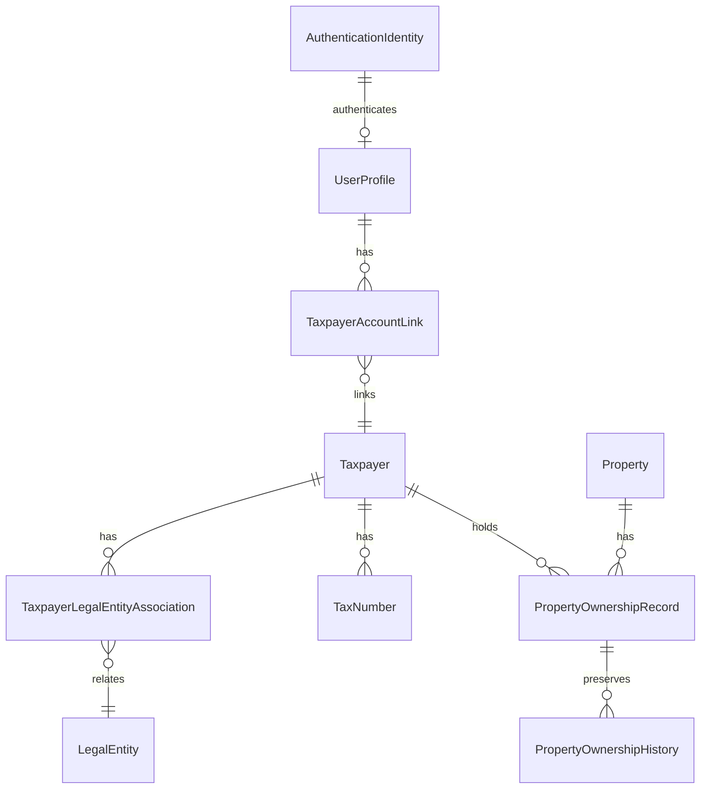
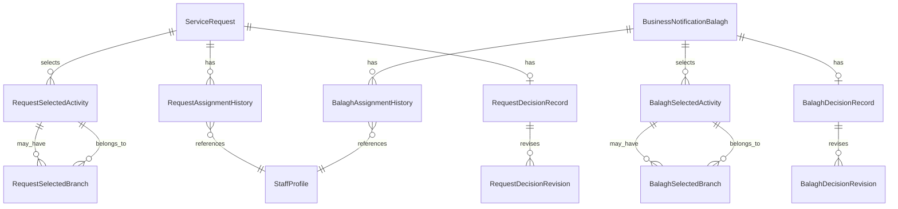
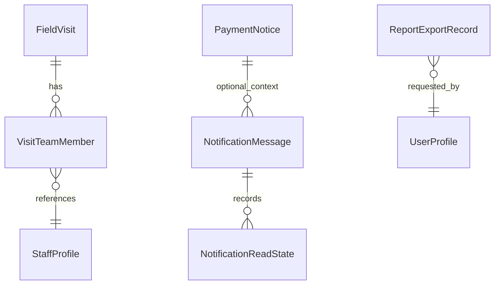

# MARIB-TAX-LOGICAL-ERD-01

**Status:** Logical ERD; the relationship catalog is authoritative. Due–Receipt business cardinality is unresolved — **يحتاج اعتماد لاحق**.

**Due–Receipt note (no Mermaid edge):** Due–Receipt business cardinality is unresolved. **يحتاج اعتماد لاحق**. Payment Confirmation still requires an accepted Payment Receipt. Receipt correction/replacement history is retained. No gateway, payment provider, or settlement integration is modeled.

Property authority is Activities and Branches; a direct Taxpayer-to-Property view is derived from active ownership records. Request and Balagh children are parallel concrete families owned by their respective modules. Branch-scoped effects apply only to the selected Branch; unrelated branches remain unchanged (IR-72).
