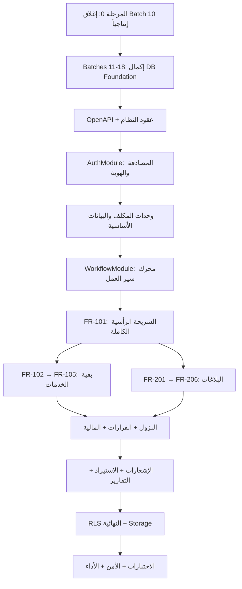

# الخطة التنفيذية لإكمال مشروع مكتب الضرائب بمحافظة مأرب
## التركيز: Backend — الأساسات

---

## ملخص الوضع الحالي

| المحور | الإنجاز | الحالة |
|---|---|---|
| التحليل والمتطلبات | ~90% | ✅ مكتمل |
| المعمارية والحوكمة | ~90% | ✅ مكتمل |
| نواة قاعدة البيانات (Batches 01A–09) | مطبّقة ومُحقّقة | ✅ APPLIED / VERIFIED PASS |
| Batch 10 (المستحقات والسداد) | المصدر مدموج + Preflight | ⏸️ ينتظر تطبيق إنتاجي |
| Batches 11–18 | لم تبدأ | ❌ NOT STARTED |
| Backend التشغيلي (NestJS Modules) | هيكل أساسي فقط | ❌ ~10-15% |
| Flutter | تصور وظيفي فقط | ❌ <10% |
| لوحة الإدارة Next.js | تصور فقط | ❌ <10% |
| الإنجاز الكلي التقريبي | **25–30%** | المتبقي: **70–75%** |

---

## البنية الحالية للمشروع

```
Marib_Tax/
├── apps/
│   ├── api/          ← NestJS (هيكل أساسي — الوحدات التشغيلية غير مبنية)
│   ├── web/          ← Next.js (فارغ تقريباً)
│   ├── mobile/       ← Flutter (فارغ تقريباً)
│   └── worker/       ← Worker للمهام الخلفية
├── packages/
│   ├── config/       ← إعدادات مشتركة
│   ├── contracts/    ← OpenAPI / DTOs
│   ├── shared-types/ ← أنواع مشتركة
│   └── testing/      ← أدوات اختبار
├── supabase/
│   └── migrations/   ← 10 ملفات (Batches 01A–10)
├── database/
├── infrastructure/
├── scripts/
└── docs/
```

---

## الخطة التنفيذية — مرتبة حسب الأولوية

> [!IMPORTANT]
> التركيز الحالي على **Backend** (قاعدة البيانات + NestJS API) لأنها الأساس الذي يُبنى عليه كل شيء.

---

## 🔴 المرحلة صفر — إغلاق Batch 10 إنتاجياً

| البند | التفصيل |
|---|---|
| **الهدف** | تطبيق جداول المستحقات والسداد السبعة على قاعدة الإنتاج |
| **المدخلات** | PR #73 (Source) + PR #74 (Preflight) — مدموجتان |
| **Merge SHA** | `eee6c9a7f6c98b7c6aed84362b51f87301aef5de` |

### الخطوات:
1. ✅ مراجعة Merge SHA والتحقق أن Migration واحدة فقط Pending
2. ⬜ تنفيذ `db push` واحد
3. ⬜ فحص migration history
4. ⬜ تشغيل Verifier
5. ⬜ التأكد من إنشاء 7 جداول فارغة: `payment_dues`, `due_basis_document_references`, `due_corrections`, `payment_notices`, `payment_receipts`, `receipt_correction_replacements`, `payment_confirmations`
6. ⬜ فحص RLS والقيود والفهارس
7. ⬜ Dry-run → توثيق Post-Apply → PR → CI → Merge → إغلاق PROD-DB-10

> [!CAUTION]
> يتطلب **موافقتك الإنتاجية المستقلة** قبل تنفيذ `db push`.

### معيار الإغلاق:
```
BATCH_10 = APPLIED / VERIFIED PASS
PROD-DB-10 = CLOSED
```

---

## 🟠 المسار الأول — إكمال الأساس البياني (Batches 11–18)

### Batch 11 — الإشعارات ومحاولات الإرسال
| الجداول | الوظيفة |
|---|---|
| notification_events | أحداث الإشعارات |
| notification_deliveries | محاولات التسليم لكل قناة |
| notification_outbox | المهام القابلة لإعادة المحاولة |
| notification_templates | قوالب الرسائل |
| device_tokens | رموز أجهزة Push |
| notification_preferences | تفضيلات المستخدم |

**ضوابط:** Outbox pattern — لا إرسال SMS حقيقي — منع التكرار — تسجيل كل محاولة.

---

### Batch 12 — الاستيراد وجودة البيانات
| الجداول | الوظيفة |
|---|---|
| import_jobs | دفعات الاستيراد |
| import_files | ملفات مرفوعة |
| import_rows | صفوف المعاينة |
| import_errors | أخطاء وتحذيرات |
| import_matches | مطابقة مع القائم |

**تدفق:** Upload → Parse → Normalize → Validate → Preview → Approve → Commit → Report

---

### Batch 13 — المحتوى والموقع العام
| الجداول | الوظيفة |
|---|---|
| content_pages + content_versions | صفحات بإصدارات |
| announcements | إعلانات بفترات عرض |
| library_documents | نماذج/قوانين/لوائح/قرارات |
| faqs | أسئلة شائعة |

**قواعد:** مسودة → نشر → أرشفة — لا تعديل صامت للمنشور.

---

### Batch 14 — التدقيق الأمني وDomain Events
| الجداول | الوظيفة |
|---|---|
| audit_logs | سجل تدقيق شامل (Actor, Before/After, IP) |
| domain_events | أحداث المجال الداخلية |
| event_outbox | Outbox للأحداث الخارجية |

---

### Batch 15 — التقارير والتصدير
| الجداول | الوظيفة |
|---|---|
| report_definitions | تعريفات التقارير |
| report_exports / report_jobs | وظائف التصدير غير المتزامن |
| saved_report_filters | فلاتر محفوظة |

---

### Batch 16 — الفهارس وتحسين الأداء
- فهارس مركبة: `status/submitted_at/service_id/assignee_id/taxpayer_id`
- فهارس البحث والتقارير
- EXPLAIN للاستعلامات الأساسية
- منع الفهارس المكررة

---

### Batch 17 — RLS والصلاحيات النهائية
- سياسات الوصول لكل Schema
- مصفوفة إيجابية وسلبية كاملة
- اختبار استدعاء API مباشر (ليس فحص أزرار فقط)
- 11 دوراً: مكلف، استقبال، مراجع، نزول، رئيس فريق، مالي، مدير إدارة، مدير مكتب، محتوى، تقني، مدقق

---

### Batch 18 — Storage والمرفقات
- إنشاء Buckets الخاصة
- Signed URLs قصيرة المدة
- MIME validation + حجم الملف
- منع الملفات التنفيذية
- Retention + Legal Hold
- 9 فئات ملفات (هوية، نشاط، ملكية، طلبات، بلاغات، زيارات، إيصالات، قرارات، استيراد)

### معيار إغلاق المسار الأول:
```
DATABASE FOUNDATION = COMPLETE
BATCHES 01A–18 = ALL APPLIED / VERIFIED PASS
```

---

## 🟡 المسار الثاني — عقود النظام والبنية الخلفية (NestJS)

### المرحلة A — OpenAPI وعقود النظام
1. تعريف DTOs لكل وحدة
2. OpenAPI 3.x كامل مع Problem Details
3. Pagination (cursor-based)، Idempotency-Key، Correlation ID
4. توليد Clients لـ TypeScript و Dart
5. Contract tests

### المرحلة B — Auth والهوية (AuthModule)
1. التسجيل برقم الهاتف + OTP (Twilio Verify)
2. كلمة المرور القوية
3. تسجيل الدخول (هاتف + كلمة مرور)
4. استعادة كلمة المرور عبر OTP
5. الجلسات والأجهزة وإبطال الجلسات
6. قفل الحساب المؤقت بعد محاولات فاشلة
7. Rate limiting ومنع تعداد المستخدمين
8. ربط المستخدم بملف مكلف أو موظف
9. JWT validation في كل request

### المرحلة C — وحدات المكلف والبيانات الأساسية
| الوحدة | الوظائف |
|---|---|
| TaxpayersModule | ملف المكلف، ربط الرقم الضريبي (Claim)، بحث |
| LegalEntitiesModule | كيانات قانونية (CRUD) |
| ActivitiesAndBranchesModule | أنشطة، فروع، عناوين |
| PropertiesModule | عقارات، ملاك، تاريخ ملكية |
| ServicesAndVersionsModule | خدمات بإصدارات، متطلبات، حقول نموذج |

### المرحلة D — محرك سير العمل (WorkflowModule)
- `WorkflowService.transition(requestId, targetState, actor, payload)`
- التحقق من: الحالة السابقة → الصلاحية → البيانات → المرفقات → القرار
- داخل Transaction واحدة: تحديث الطلب + سجل حالة + Audit + Notification Outbox
- مصفوفة الانتقالات المعتمدة (14 انتقالاً أساسياً)

---

## 🟢 المسار الثالث — الشريحة الرأسية FR-101 (كامل E2E)

> [!TIP]
> هذه أهم مرحلة — تثبت أن كل الطبقات تعمل معاً بنجاح قبل تعميم بقية الخدمات.

### التدفق الكامل لـ FR-101 (فتح ملف ضريبي):
```
تسجيل المكلف → فتح ملفه → إنشاء طلب → حفظ مسودة
→ رفع المستندات (هوية + سجل تجاري + بيانات نشاط)
→ التحقق من الاكتمال → إرسال الطلب
→ استلام الموظف → المراجعة
→ طلب استكمال (اختياري) → النزول الميداني
→ إعداد القرار → اعتماد المدير
→ إصدار المخرج (استمارة الحصر)
→ إشعار المكلف → الإغلاق والأرشفة
```

### ما يجب تغطيته:
- [x] API كامل
- [x] قاعدة البيانات
- [x] الصلاحيات
- [x] المرفقات
- [x] الإشعارات (In-App + Outbox)
- [x] التقارير
- [x] التدقيق
- [x] حالات الفشل والتراجع

---

## 🔵 المسار الرابع — استكمال الخدمات والبلاغات

### الخدمات (FR-102 → FR-105):
| الكود | الخدمة | ملاحظة خاصة |
|---|---|---|
| FR-102 | استخراج رقم ضريبي | لمن لا يملك رقماً — نزول + مستحقات محتملة |
| FR-103 | بدل فاقد | قد يطلب حضور لتحديد موقف |
| FR-104 | تحديث بيانات/أسماء تجارية | حفظ السابق والجديد |
| FR-105 | شهادة ضريبة المبيعات | نسخة إلكترونية عند الجاهزية |

### البلاغات (FR-201 → FR-206):
| الكود | البلاغ | نزول؟ |
|---|---|---|
| FR-201 | إيقاف نشاط | ✅ نعم |
| FR-202 | خروج مستأجر/إخلاء عقار | ✅ نعم |
| FR-203 | خروج عامل | ✅ نعم |
| FR-204 | تغيير عنوان النشاط | ✅ نعم |
| FR-205 | نقل ملكية عقار | ✅ نعم |
| FR-206 | تفعيل نشاط موقوف | ❌ لا |

---

## 🟣 المسار الخامس — النزول والقرارات والمالية

### FieldVisitsModule
- جدولة، تشكيل فريق، نتيجة، أدلة، محضر
- التصحيح بملحق (لا تعديل صامت)
- لا زيارة مرتبطة بطلب وبلاغ معاً

### DecisionsModule
- المدير فقط يصدر القرار النهائي
- أسباب رفض من قائمة منظمة (9 أسباب)
- تنفيذ Domain Action داخل نفس Transaction

### DuesAndPaymentsModule
- إدخال يدوي + مستند أساس
- إيصال ← مستحق (N:1)
- سداد جزئي مدعوم
- لا حذف نهائي للمؤكد
- التصحيح إضافي (financial_correction)

---

## 🔴 المسار السادس — التكاملات

### NotificationsModule + Worker
- In-App (دائماً) + FCM Push + Twilio SMS
- Outbox pattern: المعاملة تنجح → Outbox → Worker يرسل
- Dead-letter queue + Retry
- لا حفظ نص OTP في السجلات

### ImportsModule
- رفع → تحليل → Preview → موافقة → ترحيل → تقرير
- لا ترحيل مباشر — لا merge صامت

### ContentModule
- CRUD مع إصدارات ومسودة/نشر/أرشفة

### ReportsModule
- 29 تقريراً معتمداً (RPT-EXEC, RPT-REQ, RPT-NOTIF, RPT-VISIT, RPT-TAXP, RPT-DUES, RPT-MSG, RPT-DOC, RPT-IMPORT, RPT-AUDIT, RPT-CMS)
- تصدير PDF/Excel غير متزامن للثقيل
- SLA مرن حسب الخدمة

### AuditModule
- Append-only
- Before/After + Correlation ID + Actor

---

## القرارات المفتوحة التي يجب حسمها قبل التنفيذ

| # | القرار | التأثير | مطلوب قبل |
|---|---|---|---|
| 1 | **الدفع الزائد** — هل يمنع النظام الزيادة أم يسمح مع تنبيه أم رصيد دائن؟ | وحدة المدفوعات | المرحلة 18 |
| 2 | **Parent المستحق (CK-T02)** — هل يرتبط كل مستحق بطلب أو بلاغ إلزامياً؟ | constraint في DB | Batch 10 Apply |
| 3 | **صلاحية تصحيح الإيصال (OD-15)** — موظف مالي أم رئيس قسم أم مدير؟ | مصفوفة الصلاحيات | Batch 17 |
| 4 | **كتالوج الحالات (DM-09)** — تثبيت enum حالات المستحق والإشعار والإيصال | Backend + DB | Batch 11 |
| 5 | **العملة والتقريب (PHY-35)** — العملة الأساسية وقواعد الكسور | المالية | Batch 10 Apply |

---

## ترتيب التنفيذ الموصى به



---

## الخطوة التالية المباشرة

> [!NOTE]
> **المطلوب منك الآن:**
> 1. مراجعة هذه الخطة وإبداء أي ملاحظات أو تعديلات
> 2. اتخاذ قرار بشأن تطبيق **Batch 10 إنتاجياً** (الخطوة المعلقة)
> 3. حسم **القرارات المفتوحة** المذكورة أعلاه (يمكن تأجيل بعضها)
> 4. تحديد **أي مرحلة** تريد البدء بها — الموصى به: Batch 10 → Batches 11–18 → OpenAPI → Auth

بمجرد موافقتك، سأبدأ التنفيذ الفعلي بالترتيب المعتمد، مع الالتزام الكامل بنظام العمل وبوابات الحوكمة المحددة.
